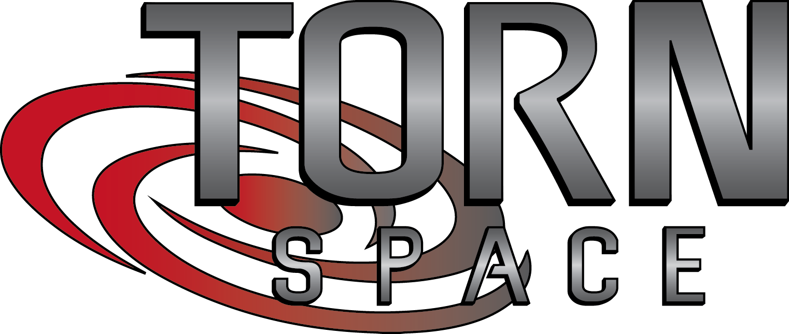

<div align="center">
    
</div>
<hr />
<div align="center">
    
    
    
    
    
    
    
</div>
<br />
<div align="center">
    Community-led torn.space clone.
</div>
<br />

## Prerequisites
 * [bun](https://bun.sh)
 * [PostgreSQL](http://postgresql.org)

## Installation
In the root directory, run the following command to install packages for all directories and subdirectories.
```
bun ci
```

## Contributing
Please follow the conventions found in `COMMIT_FORMAT.md`. Any changes must be made through a pull request.
History rewrites are permitted on all branches except `master`. Squash / rebase as necessary to maintain a clean PR.
